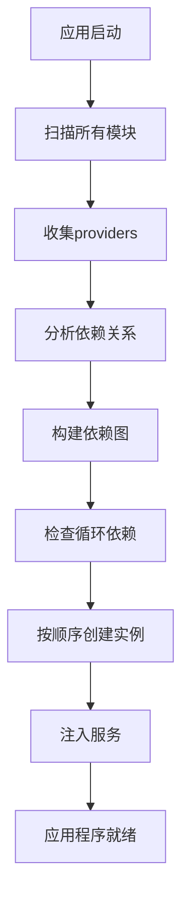

# NestJS模块Import与Export详解

## 目录

1. [模块的基本概念](#1-模块的基本概念)
2. [Import和Export的作用](#2-import和export的作用)
3. [依赖注入容器的工作原理](#3-依赖注入容器的工作原理)
4. [模块关系的层次结构](#4-模块关系的层次结构)
5. [不同的导入导出场景](#5-不同的导入导出场景)
6. [常见错误和解决方案](#6-常见错误和解决方案)
7. [最佳实践](#7-最佳实践)
8. [高级特性](#8-高级特性)
9. [实际案例分析](#9-实际案例分析)
10. [总结](#10-总结)

---

## 1. 模块的基本概念

### 什么是模块？

模块是NestJS应用程序的基本构建块，它将相关的功能组织在一起。每个模块都是一个带有 `@Module()` 装饰器的类。

```typescript
@Module({
  imports: [], // 导入其他模块
  controllers: [], // 当前模块的控制器
  providers: [], // 当前模块的服务提供者
  exports: [], // 导出供其他模块使用的服务
})
export class MyModule {}
```

### 模块的核心作用

- **组织代码**：将相关功能聚合在一起
- **依赖管理**：管理服务之间的依赖关系
- **封装性**：隐藏内部实现细节
- **可复用性**：模块可以在不同地方重复使用

### 模块的类型

1. **功能模块**：实现特定业务功能（如UserModule、OrderModule）
2. **共享模块**：提供通用功能（如DatabaseModule、ConfigModule）
3. **核心模块**：应用程序的核心功能
4. **根模块**：应用程序的入口模块（AppModule）

---

## 2. Import和Export的作用

### Export（导出）的作用

```typescript
// src/user/user.module.ts
@Module({
  providers: [UserService, UserRepository],
  exports: [UserService], // 🔑 关键：导出UserService
})
export class UserModule {}
```

**Export的含义：**

- **"我提供这个服务，其他模块可以使用"**
- **将模块内部的服务暴露给外部**
- **没有export的服务只能在当前模块内部使用**
- **控制模块的公共API**

**Export的语法形式：**

```typescript
// 1. 导出服务类
exports: [UserService];

// 2. 导出字符串令牌
exports: ['USER_SERVICE'];

// 3. 导出整个模块
exports: [DatabaseModule];

// 4. 导出provider对象
exports: [
  {
    provide: 'IUserService',
    useClass: UserService,
  },
];
```

### Import（导入）的作用

```typescript
// src/order/order.module.ts
@Module({
  imports: [UserModule], // 🔑 关键：导入UserModule
  providers: [OrderService],
  exports: [OrderService],
})
export class OrderModule {}
```

**Import的含义：**

- **"我需要使用另一个模块的服务"**
- **获取其他模块导出的服务**
- **建立模块之间的依赖关系**
- **声明模块的外部依赖**

**Import的语法形式：**

```typescript
// 1. 导入静态模块
imports: [UserModule];

// 2. 导入动态模块
imports: [
  ConfigModule.forRoot({
    isGlobal: true,
  }),
];

// 3. 导入异步模块
imports: [
  DatabaseModule.forRootAsync({
    useFactory: async (configService: ConfigService) => ({
      host: configService.get('DB_HOST'),
    }),
    inject: [ConfigService],
  }),
];
```

---

## 3. 依赖注入容器的工作原理

### 服务注册过程

```typescript
// 步骤1：UserModule注册UserService
@Module({
  providers: [UserService], // 向DI容器注册
  exports: [UserService], // 声明可以被其他模块使用
})
export class UserModule {}

// 步骤2：OrderModule导入UserModule
@Module({
  imports: [UserModule], // 告诉DI容器：我需要UserModule的服务
  providers: [OrderService],
})
export class OrderModule {}

// 步骤3：在OrderService中注入UserService
@Injectable()
export class OrderService {
  constructor(
    private readonly userService: UserService, // DI容器自动注入
  ) {}
}
```

### DI容器的工作流程



1. **注册阶段**：扫描所有模块，收集providers
2. **构建依赖图**：分析模块之间的依赖关系
3. **验证阶段**：检查循环依赖和缺失依赖
4. **创建实例**：按依赖顺序创建服务实例
5. **注入阶段**：将服务实例注入到需要的地方

### 依赖解析机制

```typescript
// DI容器如何解析依赖
@Injectable()
export class OrderService {
  constructor(
    private readonly userService: UserService, // 1. 通过类型解析
    @Inject('CONFIG') private config: any, // 2. 通过令牌解析
    @Optional() private logger?: LoggerService, // 3. 可选依赖
  ) {}
}
```

---

## 4. 模块关系的层次结构

```typescript
// 根模块
@Module({
  imports: [
    ConfigModule.forRoot({ isGlobal: true }),
    UserModule, // 导入用户模块
    OrderModule, // 导入订单模块
    DatabaseModule, // 导入数据库模块
  ],
  controllers: [AppController],
  providers: [AppService],
})
export class AppModule {}
```

**模块关系图：**

```
AppModule (根模块)
├── ConfigModule (全局模块)
├── DatabaseModule (基础设施模块)
├── UserModule (业务模块)
│   ├── UserService
│   ├── UserRepository
│   └── UserController
└── OrderModule (业务模块)
    ├── OrderService
    ├── OrderController
    └── 依赖 → UserService (来自UserModule)
```

### 模块层次设计原则

1. **单向依赖**：避免循环依赖
2. **分层架构**：基础设施层 → 核心业务层 → 应用层
3. **最小依赖**：只导入必要的模块
4. **清晰边界**：每个模块有明确的职责

---

## 5. 不同的导入导出场景

### 场景1：简单的服务共享

```typescript
// UserModule提供服务
@Module({
  providers: [UserService],
  exports: [UserService], // 导出给其他模块使用
})
export class UserModule {}

// OrderModule使用服务
@Module({
  imports: [UserModule], // 导入整个模块
  providers: [OrderService],
})
export class OrderModule {}
```

### 场景2：全局模块

```typescript
// ConfigModule设置为全局
@Module({
  imports: [
    ConfigModule.forRoot({
      isGlobal: true, // 🔑 全局模块，所有模块都可以使用
    }),
  ],
})
export class AppModule {}

// 其他模块无需导入ConfigModule就能使用ConfigService
@Injectable()
export class UserService {
  constructor(
    private configService: ConfigService, // 直接可用
  ) {}
}
```

### 场景3：模块重新导出

```typescript
// CommonModule重新导出其他模块的服务
@Module({
  imports: [UserModule, OrderModule],
  exports: [UserModule, OrderModule], // 重新导出
})
export class CommonModule {}

// 其他模块只需导入CommonModule就能使用所有服务
@Module({
  imports: [CommonModule], // 一次导入，获得多个服务
})
export class FeatureModule {}
```

### 场景4：动态模块

```typescript
// 动态模块配置
@Module({})
export class DatabaseModule {
  static forRoot(options: DatabaseOptions): DynamicModule {
    return {
      module: DatabaseModule,
      providers: [
        {
          provide: 'DATABASE_OPTIONS',
          useValue: options,
        },
        DatabaseService,
      ],
      exports: [DatabaseService],
    };
  }
}

// 使用动态模块
@Module({
  imports: [
    DatabaseModule.forRoot({
      host: 'localhost',
      port: 3306,
    }),
  ],
})
export class AppModule {}
```

### 场景5：异步模块

```typescript
// 异步模块配置
@Module({})
export class DatabaseModule {
  static forRootAsync(options: DatabaseAsyncOptions): DynamicModule {
    return {
      module: DatabaseModule,
      imports: options.imports || [],
      providers: [
        {
          provide: 'DATABASE_OPTIONS',
          useFactory: options.useFactory,
          inject: options.inject || [],
        },
        DatabaseService,
      ],
      exports: [DatabaseService],
    };
  }
}

// 使用异步模块
@Module({
  imports: [
    DatabaseModule.forRootAsync({
      imports: [ConfigModule],
      useFactory: async (configService: ConfigService) => ({
        host: configService.get('DB_HOST'),
        port: configService.get('DB_PORT'),
      }),
      inject: [ConfigService],
    }),
  ],
})
export class AppModule {}
```

---

## 6. 常见错误和解决方案

### 错误1：忘记导出服务

```typescript
// ❌ 错误：没有导出UserService
@Module({
  providers: [UserService],
  // exports: [UserService], // 忘记导出
})
export class UserModule {}

// 结果：其他模块无法使用UserService
// 错误信息：Nest can't resolve dependencies of the OrderService (?)
```

**解决方案：**

```typescript
// ✅ 正确：导出需要共享的服务
@Module({
  providers: [UserService],
  exports: [UserService], // 记得导出
})
export class UserModule {}
```

### 错误2：重复提供服务

```typescript
// ❌ 错误：在多个模块中都提供同一个服务
@Module({
  providers: [UserService], // 重复提供
})
export class OrderModule {}

// 结果：创建多个实例，数据不共享
```

**解决方案：**

```typescript
// ✅ 正确：只在一个模块中提供服务
@Module({
  imports: [UserModule], // 导入而不是重复提供
  providers: [OrderService],
})
export class OrderModule {}
```

### 错误3：循环依赖

```typescript
// ❌ 错误：模块A导入模块B，模块B又导入模块A
@Module({
  imports: [ModuleB],
  exports: [ServiceA],
})
export class ModuleA {}

@Module({
  imports: [ModuleA], // 循环依赖
  exports: [ServiceB],
})
export class ModuleB {}
```

**解决方案：**

```typescript
// ✅ 解决方案1：使用forwardRef
@Module({
  imports: [forwardRef(() => ModuleB)],
  exports: [ServiceA],
})
export class ModuleA {}

// ✅ 解决方案2：创建共享模块
@Module({
  providers: [SharedService],
  exports: [SharedService],
})
export class SharedModule {}

@Module({
  imports: [SharedModule],
  exports: [ServiceA],
})
export class ModuleA {}
```

### 错误4：导入了错误的模块

```typescript
// ❌ 错误：导入了服务而不是模块
@Module({
  imports: [UserService], // 错误：应该导入模块
})
export class OrderModule {}
```

**解决方案：**

```typescript
// ✅ 正确：导入模块
@Module({
  imports: [UserModule], // 正确：导入模块
})
export class OrderModule {}
```

---

## 7. 最佳实践

### 1. 单一职责原则

```typescript
// ✅ 好的做法：每个模块负责一个功能领域
@Module({
  providers: [UserService, UserRepository, UserValidator],
  controllers: [UserController],
  exports: [UserService], // 只导出对外接口
})
export class UserModule {}
```

### 2. 明确的依赖关系

```typescript
// ✅ 好的做法：清晰的模块依赖
@Module({
  imports: [
    DatabaseModule, // 数据库连接
    ConfigModule, // 配置服务
    LoggerModule, // 日志服务
  ],
  providers: [UserService],
  exports: [UserService],
})
export class UserModule {}
```

### 3. 适当的抽象层次

```typescript
// ✅ 好的做法：使用接口和抽象类
@Module({
  providers: [
    {
      provide: 'IUserService',
      useClass: UserService,
    },
    {
      provide: 'IUserRepository',
      useClass: TypeOrmUserRepository,
    },
  ],
  exports: ['IUserService'],
})
export class UserModule {}
```

### 4. 合理的模块粒度

```typescript
// ✅ 好的做法：适当的模块大小
// 用户认证相关的模块
@Module({
  providers: [AuthService, JwtService, AuthGuard],
  exports: [AuthService],
})
export class AuthModule {}

// 用户管理相关的模块
@Module({
  providers: [UserService, UserRepository],
  exports: [UserService],
})
export class UserModule {}
```

### 5. 使用工厂模式处理复杂依赖

```typescript
// ✅ 好的做法：使用工厂模式
@Module({
  providers: [
    {
      provide: 'DATABASE_CONNECTION',
      useFactory: (configService: ConfigService) => {
        return createConnection({
          host: configService.get('DB_HOST'),
          port: configService.get('DB_PORT'),
        });
      },
      inject: [ConfigService],
    },
  ],
})
export class DatabaseModule {}
```

---

## 8. 高级特性

### 1. 条件模块导入

```typescript
// 根据环境条件导入不同的模块
@Module({
  imports: [
    ConfigModule.forRoot(),
    ...(process.env.NODE_ENV === 'development' ? [DevModule] : [ProdModule]),
  ],
})
export class AppModule {}
```

### 2. 模块合并

```typescript
// 创建一个聚合模块
@Module({
  imports: [UserModule, OrderModule, ProductModule],
  exports: [UserModule, OrderModule, ProductModule],
})
export class CoreModule {}
```

### 3. 懒加载模块

```typescript
// 在需要时才加载模块
@Module({})
export class FeatureModule {
  static forRoot(): DynamicModule {
    return {
      module: FeatureModule,
      providers: [
        // 懒加载的服务
      ],
    };
  }
}
```

### 4. 模块生命周期钩子

```typescript
@Module({
  providers: [MyService],
})
export class MyModule implements OnModuleInit, OnModuleDestroy {
  constructor(private myService: MyService) {}

  async onModuleInit() {
    // 模块初始化时执行
    await this.myService.initialize();
  }

  async onModuleDestroy() {
    // 模块销毁时执行
    await this.myService.cleanup();
  }
}
```

---

## 9. 实际案例分析

### 案例1：电商应用模块设计

```typescript
// 1. 基础设施模块
@Module({
  imports: [
    ConfigModule.forRoot({ isGlobal: true }),
    DatabaseModule.forRoot(),
    LoggerModule.forRoot(),
  ],
})
export class InfrastructureModule {}

// 2. 核心业务模块
@Module({
  providers: [UserService, UserRepository],
  exports: [UserService],
})
export class UserModule {}

@Module({
  imports: [UserModule],
  providers: [OrderService, OrderRepository],
  exports: [OrderService],
})
export class OrderModule {}

@Module({
  providers: [ProductService, ProductRepository],
  exports: [ProductService],
})
export class ProductModule {}

// 3. 应用层模块
@Module({
  imports: [UserModule, OrderModule, ProductModule],
  controllers: [UserController, OrderController, ProductController],
})
export class AppModule {}
```

### 案例2：微服务通信模块

```typescript
// 消息队列模块
@Module({
  providers: [
    MessageQueueService,
    {
      provide: 'RABBITMQ_CONNECTION',
      useFactory: (configService: ConfigService) => {
        return createConnection(configService.get('RABBITMQ_URL'));
      },
      inject: [ConfigService],
    },
  ],
  exports: [MessageQueueService],
})
export class MessageQueueModule {}

// 用户服务模块
@Module({
  imports: [MessageQueueModule],
  providers: [
    UserService,
    {
      provide: 'USER_EVENT_PUBLISHER',
      useFactory: (mqService: MessageQueueService) => {
        return mqService.createPublisher('user.events');
      },
      inject: [MessageQueueService],
    },
  ],
  exports: [UserService],
})
export class UserModule {}
```

---

## 10. 总结

### Import和Export的本质

- **Export** = "我提供什么服务给别人用"
- **Import** = "我需要使用别人提供的什么服务"

### 依赖注入容器的作用

- **自动管理服务的生命周期**
- **解决依赖关系**
- **确保单例模式**（默认情况下）
- **提供灵活的配置选项**

### 模块设计原则

1. **单一职责**：每个模块有明确的职责
2. **最小依赖**：只导入必要的模块
3. **清晰边界**：明确模块的公共API
4. **避免循环依赖**：保持单向依赖关系
5. **合理抽象**：使用接口和抽象类
6. **适当粒度**：模块大小要适中

### 关键要点回顾

- 模块是NestJS应用程序的基本构建块
- Import和Export控制模块之间的依赖关系
- 依赖注入容器自动管理服务实例
- 正确的模块设计是应用程序可维护性的基础
- 全局模块、动态模块和异步模块提供了高级功能
- 遵循最佳实践可以避免常见的错误

这样的模块设计让您的NestJS应用程序具有良好的**可维护性**、**可扩展性**和**可测试性**，同时确保了依赖注入系统的正常工作。

---

## 参考资料

- [NestJS官方文档 - 模块](https://docs.nestjs.com/modules)
- [NestJS官方文档 - 依赖注入](https://docs.nestjs.com/fundamentals/dependency-injection)
- [NestJS官方文档 - 动态模块](https://docs.nestjs.com/fundamentals/dynamic-modules)

---

_文档创建时间：2024年_  
_适用版本：NestJS 10.x_
